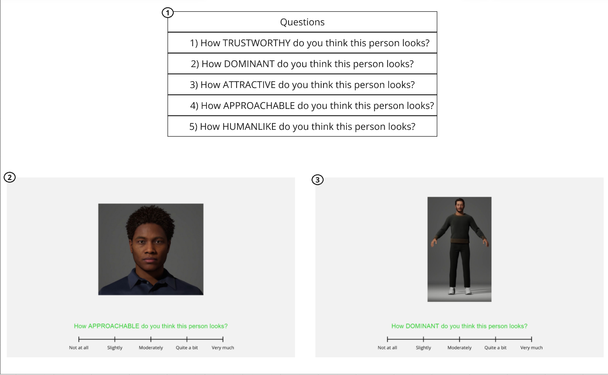

_Pre-experiment Study on Virtual Agents Selection_

Thirty-four static VAs were created using Metahuman Creator all of which are young to middle-aged male and showing a neutral facial expression. These VAs underwent a validation process through a survey and twenty-four of them were selected to be used in the first and second experiments.

Participants were presented with sixty-eight images (thirty-four face and thirty-four body images) in random order. They were asked to rate each VAs face and body images on a 5-point Likert scale on perceived trustworthiness, attractiveness, approachability, human likeness, and dominance. Questions appeared one after another for each image, and the order of the questions was also randomized.

See the images below for the questions, display of the face and body images along with a question and a 5-point Likert Scale.

